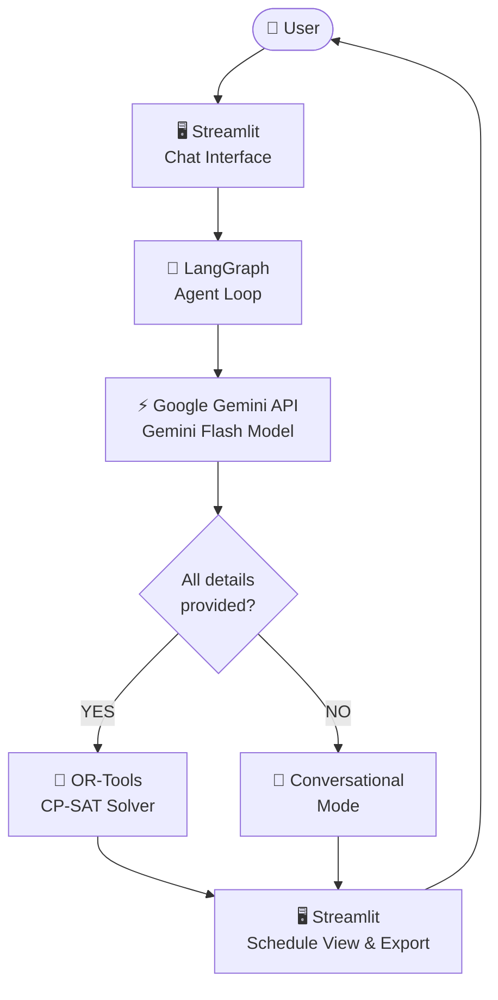
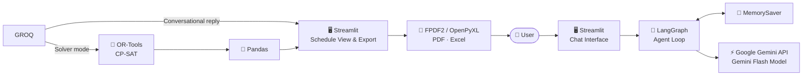

# 📅 SLOT AI — Scheduling Agent

[](https://slotai.streamlit.app)

> Ask anything about scheduling. Get a formally constraint-satisfying schedule — or a smart conversational plan — instantly.

An intelligent scheduling assistant that combines a conversational LLM with a **Google OR-Tools CP-SAT constraint solver** inside a clean Streamlit chat interface. It automatically decides whether to generate a plan using its own intelligence or to formally solve it as a constraint satisfaction problem — based on whether the user has provided all the details or wants the AI to figure them out.

---

## ✨ Features

- 🧠 **Two-mode intelligence** — automatically switches between conversational generation and formal constraint solving based on the nature of the request
- ⚙️ **OR-Tools CP-SAT solver** — mathematically guaranteed schedules with no double-booking, no conflicts, and all hard rules satisfied simultaneously
- 🌐 **Domain-agnostic** — school timetables, hospital shift rosters, gym schedules, meeting room booking, sports fixtures, work shifts — any scheduling domain
- 💬 **Multi-chat sessions** — create, switch, rename, and delete independent conversations, each with isolated memory and schedule state
- 📚 **Version history** — every regenerated schedule is archived; compare any two versions cell by cell
- 📤 **Export** — download schedules as **PDF** or **Excel**, per day or all days at once
- 🔁 **Persistent memory** — each chat thread remembers the full conversation and constraint history via LangGraph's MemorySaver
- ✅ **Constraint validation** — run a post-generation check to detect any violations (double-booking, banned rooms, overloads, unavailability breaches)

---

## 🏗️ System Architecture



---

## 🤖 Tech Stack

| Component | Technology | Purpose |
|---|---|---|
| UI | Streamlit | Chat interface, schedule display, file export |
| LLM | Google — `Gemini Flash Model` | Conversational responses + tool-calling decisions |
| Agent Framework | LangGraph (StateGraph + ToolNode) | Multi-turn agent with tool orchestration |
| LLM Client | LangChain-google-genai | Google-genai API integration |
| Constraint Solver | Google OR-Tools CP-SAT | Formally verified schedule generation |
| Data / Export | Pandas, OpenPyXL, FPDF2 | Tabular display, Excel and PDF export |

---

## 🔗 Component Flow



---

## ⚙️ How It Works

### The One Decision Rule

> **"Did the user already provide all the details, or does the agent need to come up with them?"**
>
> - **User provided everything** (who, what, where, when, rules) → **Solver mode**
> - **Agent must generate the details** → **Conversational mode**

---

### Mode 1 — Conversational (No Solver)

Used when the request is open-ended and the agent needs to generate the content itself.

| Example Request | What the Agent Does |
|---|---|
| *"Plan a 3-day trip to Paris for me"* | Decides places, timings, and activities |
| *"Give me a gym schedule for Mon/Wed/Fri"* | Decides exercises, sets, reps, split |
| *"Help me organize my study week for exams"* | Decides subjects, duration, time blocks |
| *"Suggest a morning routine"* | Decides everything from scratch |

The agent writes a clear, practical plan directly in the chat — no solver invoked.

---

### Mode 2 — Solver Mode (OR-Tools)

Used when the user has provided all the specific details and wants a formally verified assignment.

| Example Request | What the Agent Does |
|---|---|
| *"6 professors, 4 rooms, 6 slots, Mon–Fri. AI/ML only morning. CN never Room D."* | Calls tools → runs CP-SAT solver → displays grid |
| *"15 nurses, 3 wards, 3 shifts, max 5 shifts/week, Alice unavailable Fridays"* | Calls tools → runs CP-SAT solver → displays grid |
| *"10 teams, 3 courts, Sat & Sun 9am–5pm, each team plays every other once"* | Calls tools → runs CP-SAT solver → displays grid |

---

### Generic Domain Mapping

The solver uses domain-agnostic parameters that work for any scheduling domain:

| Parameter | School | Gym | Hospital | Sports |
|---|---|---|---|---|
| `assignees` | `{"Dr. A": ["Math","Physics"]}` | `{"trainer": ["squat","bench"]}` | `{"Alice": ["morning_shift"]}` | `{"Team A": ["match_1"]}` |
| `locations` | `["Room A","Room B"]` | `["gym_floor"]` | `["Ward A","ICU"]` | `["Court 1","Court 2"]` |
| `time_slots` | `["09:00-09:50","09:50-10:40"]` | `["Set 1","Set 2"]` | `["Morning","Afternoon"]` | `["10:00-11:00","11:00-12:00"]` |
| `periods` | `["Monday","Tuesday"]` | `["Mon","Wed","Fri"]` | `["Week 1 Day 1"]` | `["Saturday","Sunday"]` |

---

## 🛠️ Agent Tools

| Tool | Purpose |
|---|---|
| `extract_constraints` | Parses and stores all scheduling data from the user's message |
| `solve_timetable` | Runs the OR-Tools CP-SAT solver to generate a valid schedule |
| `edit_timetable` | Updates specific constraints and re-runs the solver (delta only) |
| `validate_timetable` | Checks the current schedule for double-booking, location violations, overloads, unavailability breaches |
| `show_timetable` | Displays the current schedule in the UI |
| `get_timetable_history` | Lists all previously generated versions with timestamps |
| `compare_timetables` | Diffs any two versions cell by cell, showing every change |

### Optional Constraints Supported

| Constraint | Description | Example |
|---|---|---|
| `location_restrictions` | Task forbidden from specific locations | CN never in Room D |
| `time_slot_restrictions` | Task restricted to certain time slots only | AI/ML in morning only |
| `assignee_unavailability` | Assignee unavailable on certain periods | Alice unavailable Fridays |
| `max_per_period` | Maximum tasks an assignee can have in one period | Dr. Bob max 2 classes/day |
| `fixed_assignments` | Pin a specific task to a specific cell | Math always Monday 9am Room A |
| `custom_rules` | Any other rules as plain-text strings | Free-form constraints |

---

## 🚀 Getting Started

### Prerequisites

- Python 3.10+
- A free [Google Gemini API Key](https://aistudio.google.com/)

### Run Locally

```bash
# Clone the repository
git clone https://github.com/your-username/slot-ai.git
cd slot-ai

# Install dependencies
pip install -r requirements.txt

# Run the app
streamlit run app.py
```

Then open your browser at `http://localhost:8501`.

### Set API Key via Environment Variable

```bash
export GOOGLE_API_KEY=...
streamlit run app.py
```

Or enter it directly in the sidebar when the app opens.

---

## 💬 Usage Examples

### Open-ended request (conversational mode)

```
You:  Give me a 3-day gym plan, push-pull-legs, dumbbells only.

AI:   Here's your 3-day plan:

      Day 1 – Push: Dumbbell Bench Press 4x10, Shoulder Press 3x12 ...
      Day 2 – Pull: Dumbbell Rows 4x10, Bicep Curls 3x12 ...
      Day 3 – Legs: Goblet Squat 4x12, Romanian Deadlift 3x10 ...
```

### Hard constraint scheduling (solver mode)

```
You:  Schedule Dr. Vaibhav (AI, ML), Dr. Simha (DSA, AA), Dr. Carol (OS),
      Dr. Bob (DBMS), Dr. Alice (CN), Dr. Raj (SE).
      Rooms: A, B, C, D
      Slots: 09:00-09:50, 09:50-10:40, 10:55-11:45, 11:45-12:35, 12:50-13:40, 13:40-14:30
      Days: Monday to Friday
      Rules: AI and ML only in morning slots. CN never in Room D. No double-booking.

AI:   [calls extract_constraints → solve_timetable → displays verified per-day schedule grid]
```

### Editing an existing schedule

```
You:  Dr. Carol is unavailable on Wednesdays from now.

AI:   [calls edit_timetable with only the change → solver re-runs → updated grid displayed]
```

### Comparing versions

```
You:  What changed between version 1 and version 3?

AI:   [calls compare_timetables → lists every cell that changed across all days]
```

### Validating a schedule

```
You:  Are there any violations in the current schedule?

AI:   [calls validate_timetable → reports double-bookings, location violations, overloads]
```

---

## 📁 Repository Structure

```
slot-ai/
├── app.py              # Entire application — single file
├── requirements.txt    # Python dependencies
└── README.md
```

---

## 📦 Dependencies

**`requirements.txt`**

```
streamlit
langchain-google-genai
langchain-core
langchain-community
langgraph
ortools
pandas
openpyxl
fpdf2
```

---

## 🌟 Key Design Decisions

**Two-mode intelligence over a single approach**
Rather than forcing all scheduling requests through the constraint solver (which fails for open-ended questions) or always generating text (which cannot verify hard rules), SLOT AI detects the nature of the request and routes accordingly.

**OR-Tools over LLM-generated tables**
When hard constraints exist, the LLM is explicitly forbidden from writing a schedule itself. LLM-generated tables look plausible but silently violate constraints. The CP-SAT solver guarantees all rules are satisfied simultaneously.

**Domain-agnostic solver**
The solver uses generic parameter names (`assignees`, `locations`, `time_slots`, `periods`) rather than domain-specific names, making it applicable to any scheduling domain without code changes.

**Per-thread isolated memory**
Each chat session has its own LangGraph MemorySaver and constraint store, so switching between chats never leaks state between conversations.

**Version archiving**
Every time the solver runs on an existing schedule, the previous version is automatically archived, enabling rollback and cell-by-cell comparison at any point.

**Single-file architecture**
The entire application lives in `app.py` for simplicity of deployment and demonstration.

---

## ⚠️ Limitations

- Schedules are stored **in-memory** per browser session — refreshing the page resets all data
- The CP-SAT solver has a **30-second timeout** — very large or heavily constrained problems may time out
- PDF export requires all text to be **Latin-1 encodable**

---

## 🔑 API Keys

| Service | Purpose | Get Key |
|---|---|---|
| Google | Serves `Google Gemini Flash Model` for conversational responses and tool-calling | [aistudio.google.com](https://aistudio.google.com/) |

Keys are entered via the sidebar and are **never stored** — they exist only within your active Streamlit session.

---

## 👨‍💻 Author

**[Vaibhav Simha J](https://www.linkedin.com/in/vaibhav-simha-j-0b46b5327/)**

📧 vaibhavsimhajworks@gmail.com

---

## 📄 License

This project was developed by [Vaibhav Simha J](https://www.linkedin.com/in/vaibhav-simha-j-0b46b5327/). Feel free to explore, learn from, and build upon this work with appropriate attribution.

---

*Conversational. Constraint-aware. Domain-agnostic.*
*One agent. Two modes. Any scheduling problem.*
